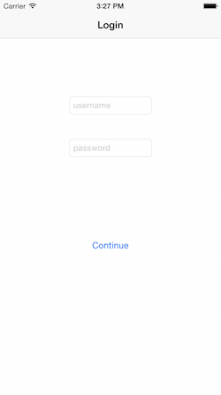
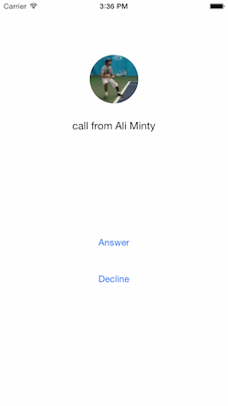
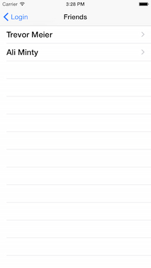
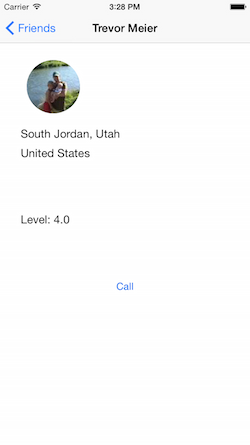
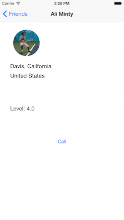
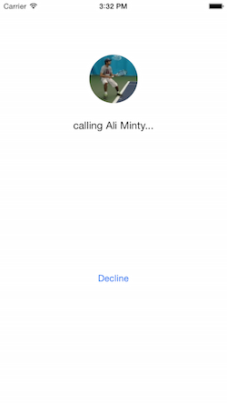

# Build a Tennis App to Call your Tennis Friends from Global Tennis Network

In this tutorial, you will learn how to create an app that calls friends from you [Global Tennis Network](https://www.globaltennisnetwork.com) profile. To get the most out of this tutorial, you will need to be familiar with the following topics:

* XCode
* Objective-C
* CocoaPods

 


# 1. Setup

First, you will want to create an app on you [Sinch Dashboard](https://www.sinch.com/dashboard/). Take note of the application key and secret, as we will need them later.

Next, go to the [GTN Developer Site](https://www.globaltennisnetwork.com/home/developers) and opt to become a developer. You will be provided with a developer key. Save that for later.

We will be working with a starter project that you can download from [Github](#github link#). Once you have the starter project downloaded, use the included **Podfile** to install the necessary CocoaPods through Terminal with the command `pod install`. Am XCode workspace should now be available for us to use.

# 2. Using the GTN API

To start, we will want to log the user in when his or her credentials are entered. Go to **LoginViewController.m** and implement the method `LoginAction` as follows:

```objective-c
- (IBAction)LoginAction:(id)sender {
    NSString *userName = self.UsernameTextField.text;
    NSString *password = self.PasswordTextField.text;
    NSString *devKey = @"your-gtn-dev-key";
    NSString *urlString = [NSString stringWithFormat:@"https://www.globaltennisnetwork.com/component/api?apiCall=getSession&format=raw&username=%@&password=%@&devKey=%@", userName, password, devKey];
    NSURL *url = [NSURL URLWithString:urlString];
    NSURLRequest *request = [NSURLRequest requestWithURL:url];
    
    NSURLResponse *response;
    NSError *error;
    NSData *responseData = [NSURLConnection sendSynchronousRequest:request returningResponse:&response error:&error];
    NSString *responseString = [[NSString alloc] initWithData:responseData encoding:NSUTF8StringEncoding];
    if(!error)
    {
        //NSLog(@"Response from server = %@", responseString);
        
        // 1
    }
} 
```

Here, we fetch user data from the GTN server using the user's username and password. Be sure to fill it your GTN developer key. There's a commented NSLog statement to log your server response if needed.

To use the data we've fetched, replace the comment `// 1` with the following code:

```objective-c
NSArray *components1 = [responseString componentsSeparatedByString:@"<userID>"];
NSArray *components2 = [components1[1] componentsSeparatedByString:@"</userID>"];
self.username = components2[0];
        
[[NSNotificationCenter defaultCenter] postNotificationName:@"UserDidLoginNotification"
                                                    object:nil
                                                  userInfo:@{@"userId" : self.username}];
        
[self performSegueWithIdentifier:@"showMaster" sender:self.username];

```

Now, we get the the user ID and use it to login. We will use the user ID later to identify who sends and receives calls. To send the user ID to the next view, implement the method `prepareForSegue:sender` like this:

 ```objective-c
- (void)prepareForSegue:(UIStoryboardSegue *)segue sender:(id)sender {
     if ([[segue identifier] isEqualToString:@"showMaster"]) {
        [[segue destinationViewController] setUserID: sender];
     }
 }
```

Now go to **MasterViewController.m**. We want to make another request. This time, we want the user's friends so we can populate the table view.

Go ahead and add the following method:

```objective-c
- (void) requestFriends {
    NSString *devKey = @"your-gtn-key";
    NSString *urlString = [NSString stringWithFormat:@"https://www.globaltennisnetwork.com/component/api?apiCall=getUsersFriends&format=raw&userID=%@&devKey=%@", self.userID, devKey];
    NSURL *url = [NSURL URLWithString:urlString];
    NSURLRequest *request = [NSURLRequest requestWithURL:url];
    
    NSURLResponse *response;
    NSError *error;
    NSData *responseData = [NSURLConnection sendSynchronousRequest:request returningResponse:&response error:&error];
    NSString *responseString = [[NSString alloc] initWithData:responseData encoding:NSUTF8StringEncoding];
    if(!error)
    {
        // 2
    }
}
```

Now let's add code to parse all of the information out of the server response. There are many ways to do this (NSRegularExpression, etc.). At the end, however, you'll want to add CFriend objects to your objects array.

Go ahead and replace the `// 2` comment with the following code:

```objective-c
        NSArray *components1 = [responseString componentsSeparatedByString:@"<user>"];
        NSMutableArray *tempArray = [NSMutableArray arrayWithArray:components1];
        [tempArray removeObjectAtIndex:0];
        components1 = [NSArray arrayWithArray:tempArray];
        
        for (NSString *component in components1){
            NSArray *components2 = [component componentsSeparatedByString:@"</user>"];
            NSString *friendInfo = components2[0];
            
            CFriend *newFriend = [[CFriend alloc] init];
            NSArray *components3, *components4;
            
            components3 = [friendInfo componentsSeparatedByString:@"<id>"];
            components4 = [components3[1] componentsSeparatedByString:@"</id>"];
            [newFriend setUserID:components4[0]];
            
            components3 = [friendInfo componentsSeparatedByString:@"<firstname><![CDATA["];
            components4 = [components3[1] componentsSeparatedByString:@"]]></firstname>"];
            [newFriend setFirstName:components4[0]];
            
            components3 = [friendInfo componentsSeparatedByString:@"<lastname><![CDATA["];
            components4 = [components3[1] componentsSeparatedByString:@"]]></lastname>"];
            [newFriend setLastName:components4[0]];
            
            components3 = [friendInfo componentsSeparatedByString:@"<country><![CDATA["];
            components4 = [components3[1] componentsSeparatedByString:@"]]></country>"];
            [newFriend setCountry:components4[0]];
            
            components3 = [friendInfo componentsSeparatedByString:@"<state><![CDATA["];
            components4 = [components3[1] componentsSeparatedByString:@"]]></state>"];
            [newFriend setState:components4[0]];
            
            components3 = [friendInfo componentsSeparatedByString:@"<city><![CDATA["];
            components4 = [components3[1] componentsSeparatedByString:@"]]></city>"];
            [newFriend setCity:components4[0]];
            
            components3 = [friendInfo componentsSeparatedByString:@"<level>"];
            components4 = [components3[1] componentsSeparatedByString:@"</level>"];
            [newFriend setLevel:components4[0]];
            
            components3 = [friendInfo componentsSeparatedByString:@"<gender>"];
            components4 = [components3[1] componentsSeparatedByString:@"</gender>"];
            [newFriend setGender:components4[0]];
            
            components3 = [friendInfo componentsSeparatedByString:@"<picUrl><![CDATA["];
            components4 = [components3[1] componentsSeparatedByString:@"]]></picUrl>"];
            [newFriend setPicUrl:components4[0]];
            
            if (!self.objects) {
                self.objects = [[NSMutableArray alloc] init];
            }
            [self.objects addObject:newFriend];
            NSIndexPath *indexPath = [NSIndexPath indexPathForRow:_objects.count-1 inSection:0];
            [self.tableView insertRowsAtIndexPaths:@[indexPath] withRowAnimation:UITableViewRowAnimationAutomatic];
            [self.tableView reloadData];
        }
```

Note: This lists all of the user's friends on Global Tennis Network. I won't address how to display only friends who also have the app. 

Now we can call the method in `viewDidLoad`:

```objective-c
- (void)viewDidLoad {
    [super viewDidLoad];
    [self requestFriends];
}
```



Alright, now let's work on displaying a friend's info once they are selected. First, go to **DetailViewController.m**. Add the following method that will display the contact's picture:

```objective-c
- (void) displayPictureForUser {
    NSURL *pictureURL = [NSURL URLWithString:self.detailItem.picUrl];
    NSData *imageData = [NSData dataWithContentsOfURL:pictureURL];
    UIImage *img = [UIImage imageWithData:imageData];
    CGSize size = img.size;
    CGRect rectFrame = CGRectMake(size.width/2, size.width/2 + 50, size.width, size.height);
    UIImageView* imgv = [[UIImageView alloc] initWithImage:img];
    imgv.frame = rectFrame;
    
    // make picture into circle
    imgv.layer.cornerRadius = size.width/2;
    imgv.layer.masksToBounds = YES;
    
    [self.view addSubview:imgv];
}
```

Then, go to the method `configureView`. Add to the if-statement to fill in a friend's info and display his or her profile picture:

```objective-c
- (void)configureView {
    // Update the user interface for the detail item.
    if (self.detailItem) {
        self.ContactTitle.title = [NSString stringWithFormat:@"%@ %@", self.detailItem.firstName, self.detailItem.lastName];
        self.CityStateLabel.text = [NSString stringWithFormat:@"%@, %@", self.detailItem.city, self.detailItem.state];
        self.CountryLabel.text = self.detailItem.country;
        self.LevelLabel.text = [NSString stringWithFormat:@"Level: %@", self.detailItem.level];
        [self displayPictureForUser];
    }
}
```
Great! Now the user will be able to choose from a list of friends to see a player's info.



# 3. Making Calls with SinchService

We'll be using SinchService to send and receive calls. SinchService allows us to handle calling from anywhere in our app by initializing a SINService object in the application's AppDelegate.

First, go to **AppDelegate.h** and add the following imports:

```objective-c
#import <Sinch/Sinch.h>
#import <SinchService/SinchService.h>
```
Then, add the following property to the interface

```objective-c
@property (strong, nonatomic) id<SINService> sinch;
```

Now, go to **AppDelegate.m**. Allow the **AppDelegate** to serve as a **SINServiceDelegate** and a **SINCallClientDelegate** by adding to the implementation:

```objective-c
@interface AppDelegate () <SINServiceDelegate, SINCallClientDelegate>
@end
```

Then, add the following code to `application:didFinishLaunchingWithOptions`:

```objective-c
    id config = [SinchService configWithApplicationKey:@"application-key"
                                     applicationSecret:@"application-secret"
                                       environmentHost:@"sandbox.sinch.com"];
    
    id<SINService> sinch = [SinchService serviceWithConfig:config];
    sinch.delegate = self;
    sinch.callClient.delegate = self;
    
    void (^onUserDidLogin)(NSString *) = ^(NSString *userId) {
        [sinch logInUserWithId:userId];
    };
    
    self.sinch = sinch;
    
    [[NSNotificationCenter defaultCenter]
     addObserverForName:@"UserDidLoginNotification"
     object:nil
     queue:nil
     usingBlock:^(NSNotification *note) { onUserDidLogin(note.userInfo[@"userId"]); }];
```

Here, we are initializing the SINService object and setting up NSNotificationCenter. We need to set up NSNotificationCenter so we can log users into the app. We can use their GTN user ID's as usernames.

To handle incoming calls, implement the following method:

```objective-c
- (void)client:(id<SINCallClient>)client didReceiveIncomingCall:(id<SINCall>)call {
    
    UIViewController *top = self.window.rootViewController;
    
    NSString *devKey = @"gtn-developer-key";
    NSString *urlString = [NSString stringWithFormat:@"https://www.globaltennisnetwork.com/component/api?apiCall=getUserInfo&format=raw&userID=%@&devKey=%@", [call remoteUserId], devKey];
    NSURL *url = [NSURL URLWithString:urlString];
    NSURLRequest *request = [NSURLRequest requestWithURL:url];
    
    NSURLResponse *response;
    NSError *error;
    NSData *responseData = [NSURLConnection sendSynchronousRequest:request returningResponse:&response error:&error];
    NSString *responseString = [[NSString alloc] initWithData:responseData encoding:NSUTF8StringEncoding];
    if(!error)
    {
        CFriend *callingFriend = [[CFriend alloc] init];
        
        NSArray *components1 = [responseString componentsSeparatedByString:@"<firstname><![CDATA["];
        NSArray *components2 = [components1[1] componentsSeparatedByString:@"]]></firstname>"];
        [callingFriend setFirstName: components2[0]];
        
        components1 = [responseString componentsSeparatedByString:@"<lastname><![CDATA["];
        components2 = [components1[1] componentsSeparatedByString:@"]]></lastname>"];
        [callingFriend setLastName: components2[0]];

        components1 = [responseString componentsSeparatedByString:@"<picUrl><![CDATA["];
        components2 = [components1[1] componentsSeparatedByString:@"]]></picUrl>"];
        [callingFriend setPicUrl:components2[0]];
        
        CallViewController *controller = [top.storyboard instantiateViewControllerWithIdentifier:@"callScreen"];
        [controller setCallingFriend:callingFriend];
        //[controller setCall:call];
        [self.window.rootViewController presentViewController:controller animated:YES completion:nil];
        
    }
}
```

Whenever the user receives an incoming call, we'll send a request to the server asking for the caller's info before displaying the call screen.


Now let's enable the call button in the detail view controller. Go to **DetailViewController.m**. Start by adding this import statement at the top:

```objective-c
#import "CallViewController.h"
```

Then, add the following method to help us place calls using the SINService object from the AppDelegate:

- (id<SINCallClient>)callClient {
    return [[(AppDelegate *)[[UIApplication sharedApplication] delegate] sinch] callClient];
}

Finally, implement `CallAction` as follows:

```objective-c
- (IBAction)CallAction:(id)sender {
    CallViewController *controller = [self.storyboard instantiateViewControllerWithIdentifier:@"callScreen"];
    [controller setCallingFriend:self.detailItem];
    id<SINCall> call = [self.callClient callUserWithId:self.detailItem.userID];
    //[controller setCall:call];
    [self presentViewController:controller animated:YES completion:nil];
}
```

Now let's work on the call screen. Go to **CallViewController.h** and add the following import:

```objective-c
#import <Sinch/Sinch.h>
```

After that, add to the interface line to have it read as follows:

```objective-c
@interface CallViewController : UIViewController <SINCallClientDelegate, SINCallDelegate>
```

Then, add a SINCall property named call:

```objective-c
@property (nonatomic, readwrite, strong) id<SINCall> call;
```

Now go to **CallViewController.m**. It would be nice to see a person's profile picture during the call, so let's add the following method, similar to the one we added before:

```objective-c
- (void) displayPictureForUser {
    NSURL *pictureURL = [NSURL URLWithString:self.callingFriend.picUrl];
    NSData *imageData = [NSData dataWithContentsOfURL:pictureURL];
    UIImage *img = [UIImage imageWithData:imageData];
    CGSize size = img.size;
    CGRect rectFrame = CGRectMake(self.view.frame.size.width/2 - size.width/2, size.width/2 + 50, size.width, size.height);
    UIImageView* imgv = [[UIImageView alloc] initWithImage:img];
    imgv.frame = rectFrame;
    
    // make picture into circle
    imgv.layer.cornerRadius = size.width/2;
    imgv.layer.masksToBounds = YES;
    
    [self.view addSubview:imgv];
}
```

When the view loads, we want to assign all of the call screen's labels depending on if the call is incoming or outgoing, as well as display the person's profile picture. Let's do this by adding the following code to `viewDidLoad`:

```objective-c
if ([self.call direction] == SINCallDirectionIncoming) {
        self.AnswerButton.hidden = NO;
        self.CallLabel.text = [NSString stringWithFormat:@"call from %@ %@", self.callingFriend.firstName, self.callingFriend.lastName];
    } else {
        self.AnswerButton.hidden = YES;
        self.CallLabel.text = [NSString stringWithFormat:@"calling %@ %@...", self.callingFriend.firstName, self.callingFriend.lastName];
    }
    
    [self displayPictureForUser];
```

Now we'll need to override the call property's setter method, so add the following code:

```objective-c
- (void)setCall:(id<SINCall>)call {
    _call = call;
    _call.delegate = self;
}
```

In case you missed it earlier, we added a few commented out calls to `setCall`. Before we continue with the call screen, go back and uncomment those lines. Both should read `[controller setCall:call];`. You'll find one in **AppDelegate.m** in `client:didReceiveIncomingCall:` and the other in **DetailViewController.m** in `CallAction`.

Alright, now head back to **CallViewController.m**. Implementing the answer and decline button actions will be simple. You can implement them as follows:

```objective-c
- (IBAction)AnswerAction:(id)sender {
    [self.call answer];
    self.AnswerButton.hidden = YES;
    self.CallLabel.text = @"";
    
}

- (IBAction)HangupAction:(id)sender {
    [self.call hangup];
}
```

When using Sinch calling, you can immediately tell when a call has established or ended. This will help us add code that will execute at the start or end of a call. Let's do just that by adding the following code:

```objective-c
- (void)callDidEstablish:(id<SINCall>)call {
    self.CallLabel.text = @"";
}

- (void)callDidEnd:(id<SINCall>)call {
    [self dismissViewControllerAnimated:YES completion:nil];
}
```

 

That's it! You've created a fully functional app that lets you call your tennis friends using Sinch calling. There are even more features that you can add to this project such as Managed Push to help receive calls when the app is not open. Click [here](https://github.com/sinch/ios-managedpush-with-sinchservice) to learn more about Managed Push with SinchService. To find more tutorials, be sure to check out the [Sinch Tutorial Site](https://www.sinch.com/tutorials/) or the [Sinch Github](https://github.com/sinch).